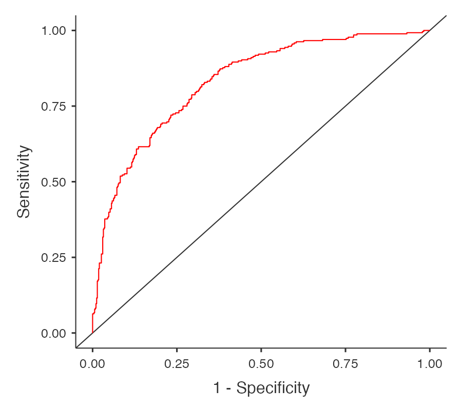

# 🩺 Clinical Diabetes Risk Analysis

> **An end-to-end clinical data analysis project exploring predictors of Type 2 Diabetes using exploratory data analysis, Pearson correlation, and multivariable logistic regression in Jamovi.**

<p align="center">
  
</p>

<p align="center">
<b>Project Snapshot</b><br>
📊 Dataset: <b>Pima Indians Diabetes Dataset (768 Participants)</b><br>
📈 Statistical Methods: <b>Exploratory Data Analysis • Pearson Correlation • Binary Logistic Regression • ROC Analysis</b><br>
📉 Model Performance: <b>AUC = 0.830 | Accuracy = 77.5%</b><br>
🛠 Software: <b>Jamovi</b>
</p>

---

# Project Overview

Type 2 Diabetes is one of the most prevalent chronic diseases worldwide and remains a major public health challenge. Understanding the demographic and clinical characteristics associated with diabetes can support earlier diagnosis, risk assessment, and improved patient management.

This project applies a structured clinical data analysis workflow using the **Pima Indians Diabetes Dataset**. Statistical analyses were completed in **Jamovi**, progressing from data quality assessment through exploratory analysis, correlation analysis, and multivariable logistic regression.

Beyond the statistical analyses, this repository emphasizes clear documentation, interpretation of findings, and reproducible project organization, reflecting practices commonly used in clinical research environments.

---

# Research Question

> **Which demographic and clinical variables are independently associated with Type 2 Diabetes?**

---

# Study Objectives

- Assess dataset quality before statistical analysis
- Identify physiologically implausible values
- Perform exploratory data analysis (EDA)
- Summarize clinical variables using descriptive statistics
- Evaluate relationships using Pearson correlation
- Develop a multivariable logistic regression model
- Evaluate predictive performance using ROC analysis
- Interpret findings within a clinical research context

---

# Dataset

**Dataset:** Pima Indians Diabetes Dataset

**Study Population:** 768 Participants

### Variables

| Variable | Description |
|-----------|-------------|
| Pregnancies | Number of pregnancies |
| Glucose | Plasma glucose concentration |
| BloodPressure | Diastolic blood pressure |
| SkinThickness | Triceps skin fold thickness |
| Insulin | Two-hour serum insulin |
| BMI | Body Mass Index |
| DiabetesPedigreeFunction | Diabetes pedigree function |
| Age | Participant age |
| Outcome | Diabetes status (0 = No Diabetes, 1 = Diabetes) |

---

# Analytical Workflow

```text
Dataset
      │
      ▼
Data Quality Assessment
      │
      ▼
Exploratory Data Analysis
      │
      ▼
Descriptive Statistics
      │
      ▼
Pearson Correlation Analysis
      │
      ▼
Binary Logistic Regression
      │
      ▼
ROC Curve & Model Evaluation
      │
      ▼
Clinical Interpretation
```

---

# Key Results

The multivariable logistic regression model identified several statistically significant predictors of Type 2 Diabetes.

| Metric | Result |
|---------|--------|
| Significant Predictors | Glucose, BMI, Blood Pressure, Pregnancies |
| Model Accuracy | 77.5% |
| Sensitivity | 59.0% |
| Specificity | 87.4% |
| AUC | **0.830** |

Overall, the model demonstrated **good discriminatory performance**, indicating an effective ability to distinguish between participants with and without Type 2 Diabetes.

---

# Skills Demonstrated

## Clinical Research

- Clinical data quality assessment
- Data interpretation
- Scientific documentation
- Research reporting

## Statistical Analysis

- Exploratory Data Analysis (EDA)
- Descriptive Statistics
- Pearson Correlation Analysis
- Binary Logistic Regression
- ROC Curve Analysis
- Model Performance Evaluation

## Technical

- Jamovi
- GitHub
- Markdown Documentation

---

# Statistical Software

This project was completed using **Jamovi**. The statistical methods demonstrated—including descriptive statistics, Pearson correlation, binary logistic regression, ROC analysis, and model evaluation—are standard analytical techniques commonly performed using **IBM SPSS Statistics**, **SAS**, **R**, and other statistical software used in clinical research.

---

# Repository Structure

```text
clinical-diabetes-risk-analysis/

├── README.md
├── clinical_diabetes_risk_analysis.omv

├── data/
│   └── data_dictionary.md

├── analysis/
│   ├── 01_data_quality_assessment.md
│   ├── 02_exploratory_data_analysis.md
│   ├── 03_correlation_analysis.md
│   └── 04_logistic_regression.md

├── figures/

└── reports/
```

---

# About This Project

This independent portfolio project was completed to strengthen practical skills in clinical research methodology, healthcare data analytics, statistical modelling, and scientific reporting using a publicly available healthcare dataset.

The statistical workflow presented in this repository reflects methods commonly applied in clinical research and provides a strong foundation for implementation in statistical software such as **IBM SPSS Statistics** and **SAS**.

---

# Author

## Zeel Bhatt

**Honours Bachelor of Science**

Interested in:

- Clinical Research
- Clinical Trials
- Clinical Data Management
- Healthcare Analytics
- Biostatistics

