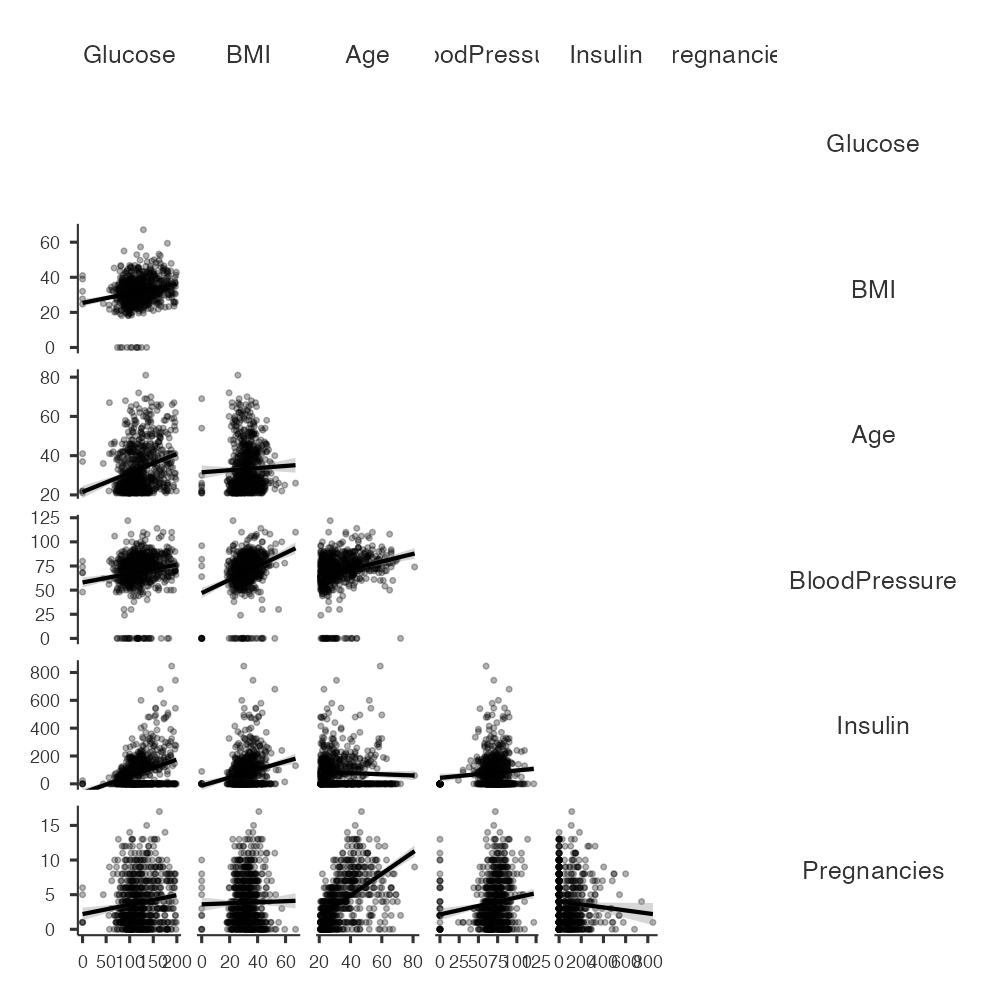

# Correlation Analysis

## Background

Pearson correlation analysis was performed to examine the strength and direction of relationships between selected clinical variables.

---

## Objective

To evaluate the linear relationships between demographic and clinical variables prior to multivariable modelling.

---

## Methods

Pearson correlation coefficients were calculated in Jamovi using the following variables:

- Glucose
- BMI
- Age
- Blood Pressure
- Pregnancies
- Insulin

Statistical significance was assessed using two-sided p-values with a significance level of 0.05.

---

## Correlation Matrix

The figure below summarizes the Pearson correlation coefficients between the selected clinical variables.

---

## Results

Several statistically significant positive correlations were observed.

| Variables | Pearson's r | p-value |
|-----------|------------:|---------:|
| Age – Pregnancies | 0.544 | < .001 |
| Glucose – Insulin | 0.331 | < .001 |
| BMI – Blood Pressure | 0.282 | < .001 |
| Glucose – Age | 0.264 | < .001 |
| Glucose – BMI | 0.221 | < .001 |

No pair of variables demonstrated a correlation coefficient high enough to indicate severe multicollinearity.

---

## Interpretation

The strongest relationship was observed between **Age** and **Pregnancies** (r = 0.544), indicating a moderate positive association.

Glucose demonstrated significant positive correlations with BMI, Insulin, and Age, suggesting that higher glucose concentrations tend to occur alongside several established clinical risk factors for Type 2 Diabetes.

Overall, the observed correlations supported inclusion of these variables in the subsequent multivariable logistic regression model.

---

## Skills Demonstrated

- Pearson Correlation Analysis
- Statistical Interpretation
- Assessment of Multicollinearity
- Clinical Data Analysis
